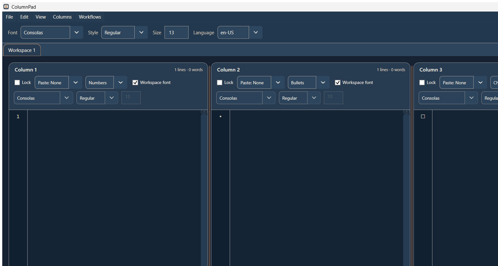

# ColumnPad Clean Rebuild

ColumnPad is a Windows desktop plain-text writing app built around side-by-side text columns.
It is designed for writing, comparing, sorting, and organising text across multiple columns inside a workspace, with support for multiple open workspaces through tabs.

This repository is the clean rebuild of ColumnPad based on the locked plain-English spec pack and the approved modern mock direction.

## Preview

Core rule:

- visual direction follows the mock board
- app behavior follows the locked spec pack

This package stays as a fresh solution structure so old patched logic does not leak back in.

## App Description

ColumnPad is not a rich text processor and it is not a fake shell around placeholder UI.
It is a real plain-text editor with locked behavior around:

- multi-workspace writing
- side-by-side column editing
- numbers, bullets, and checklist marker modes
- explicit save, export, session, and recovery flows
- search and replace across the active workspace
- theme, font, language, wrap, line-number, and lined-paper controls
- a separate workflow builder for planning and process mapping

The rebuild keeps the identity of the original app:

- plain text stays plain text
- columns are first-class
- workspaces are first-class
- checklist behavior uses real logic, not visual fakery
- file and recovery behavior stay explicit

## Project Layout

- `src/ColumnPadStudio.App` - WPF desktop app shell
- `src/ColumnPadStudio.Application` - file classification, import helpers, and export helpers
- `src/ColumnPadStudio.Domain` - plain models, marker logic, and checklist metrics
- `src/ColumnPadStudio.Infrastructure` - JSON session persistence and recovery store
- `docs/locked-spec` - locked text pack
- `docs/mocks` - visual direction board
- `docs/setup` - build and local setup notes
- `docs/reference` - repository structure notes

## Current Feature Coverage

- dark modern shell closer to the mock direction
- menu + toolbar + workspace tabs + status bar
- separate bounded writing columns
- gutter modes for numbers, bullets, and checklist
- checklist toggle by clicking the gutter in checklist mode
- add/remove/reorder columns
- add/close workspace tabs
- open support for raw TXT, raw MD, text export TXT, markdown export MD, layout JSON, and workspace session JSON
- save and save-as routing for single workspaces versus multi-workspace sessions
- export active workspace to TXT and Markdown
- simple recovery snapshots to AppData
- companion workflow builder window
- companion settings window

## Release Output

The project can be built normally through the solution or published as a single Windows executable.
Single-file publish notes live in `docs/setup/BUILD_WINDOWS.txt`.

## Build

Open `ColumnPadStudio.sln` in Visual Studio 2022 or newer and build with .NET 8 SDK installed.

Build notes live in `docs/setup/BUILD_WINDOWS.txt`.
