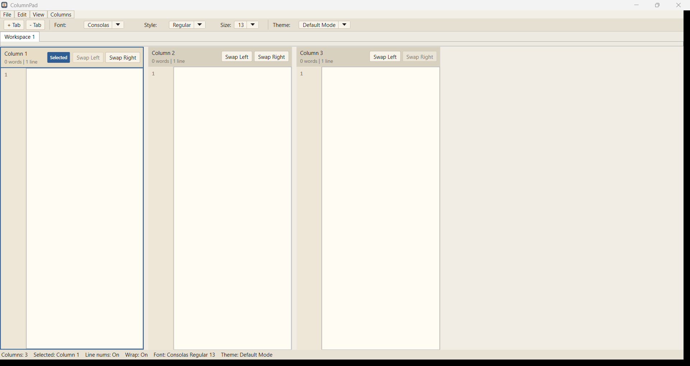

# ColumnPad

[](https://github.com/Awetspoon/ColumnPad/releases)
[](LICENSE)
[](https://github.com/Awetspoon/ColumnPad)

ColumnPad is a Windows WPF text editor built for side-by-side writing. It combines normal file editing with multi-column workspaces, workspace tabs, and a cleaner writing-focused layout than a standard notepad app.

## Screenshot



## Highlights
- Open and save real `.txt` and `.md` files.
- Save and reopen full multi-column workspaces as JSON layouts.
- Work across multiple workspace tabs in one window.
- Recover workspaces after crashes with auto-recovery.
- Use dark, light, or default theme modes.
- Format selected text as bullets or checklists.
- Download a single-file Windows `.exe` from Releases.

## Download
Get the latest Windows build from the [Releases page](https://github.com/Awetspoon/ColumnPad/releases).

Current published release:
- `ColumnPad v1.1.1`
- single-file Windows executable

## How It Works
ColumnPad supports two main ways of working:

1. File mode: open a normal `.txt` or `.md` file and save directly back to that file.
2. Workspace mode: build a multi-column layout, then save it as a layout file so column text, widths, and workspace state are preserved.

## Core Features
- Side-by-side writing columns with resize splitters.
- Workspace tabs for separate layouts and notes.
- Selected-column actions for swap, delete, width reset, and formatting.
- Clear confirmation before removing a filled column.
- Toolbar controls for font family, style, size, and theme.
- `Esc` clears text selection and exits toolbar dropdowns back to the editor.
- Checklist marker click-to-toggle behavior.
- Single-file publish profile for shipping the app as one executable.

## Build From Source
Requirements:
- Windows
- .NET 8 SDK or Visual Studio 2022/2026 with the .NET Desktop Development workload

Build and run:

```powershell
dotnet build .\ColumnPadStudio.sln -c Release
dotnet run --project .\ColumnPadStudio\ColumnPadStudio.csproj -c Release
```

## Smoke Tests

```powershell
dotnet run --project .\ColumnPadStudio.SmokeTests\ColumnPadStudio.SmokeTests.csproj -c Release
```

## Publish

```powershell
dotnet publish .\ColumnPadStudio\ColumnPadStudio.csproj -p:PublishProfile=FolderProfile
```

Publish output:
`.\ColumnPadStudio\publish\`

## Repo Notes
- Release validation steps are in `RELEASE_CHECKLIST.md`.
- Change history lives in `CHANGELOG.md`.
- The project is licensed under the MIT License. See `LICENSE`.