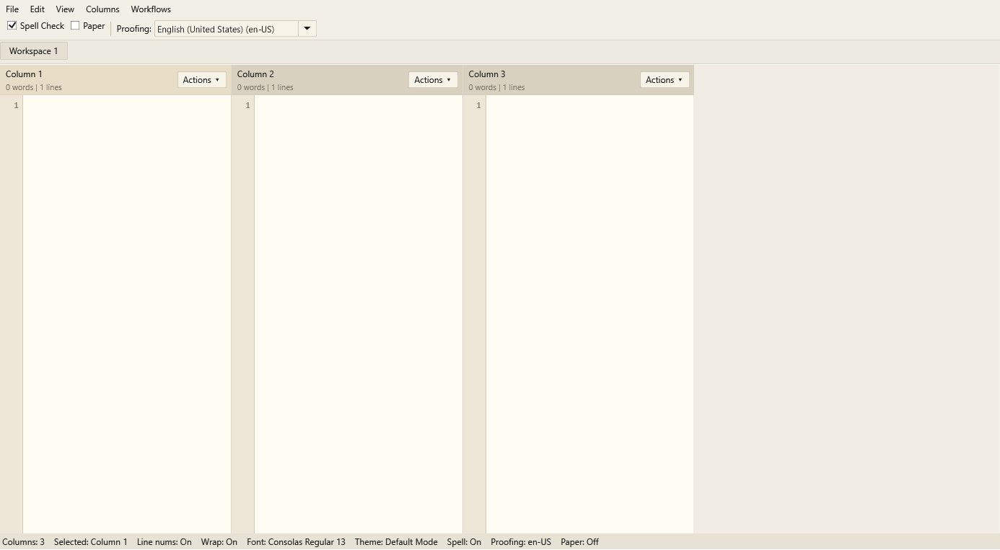

# ColumnPad

[](https://github.com/Awetspoon/ColumnPadStudio/releases)
[](LICENSE)
[](https://github.com/Awetspoon/ColumnPadStudio)

ColumnPad is a Windows desktop writing app for working in side-by-side text columns without losing structure. It combines multi-column writing, workspace tabs, saved layouts, proofing-aware editing, lined-paper mode, list/checklist helpers, and a built-in workflow planner in one offline desktop app.

## Screenshot


## What The App Does
- Lets you write in multiple independent columns at the same time.
- Saves full workspaces as `.columnpad.json` so projects reopen exactly as they were.
- Supports direct opening and clean export of `.txt`, `.md`, layout JSON, and multi-workspace session JSON.
- Keeps editing readable with line numbers, word wrap, spell check, proofing-language selection, lined paper, and theme presets.
- Includes a workflow builder for diagramming repeatable processes without relying on paid online workflow tools.

## Core Features
- Multi-column writing with invisible right-edge resize handles.
- Workspace tabs for separate writing sessions.
- Single-text mode and column mode switching.
- Direct open/save/export for text and markdown documents.
- Workspace session save/load for multiple open tabs.
- Auto-recovery and crash restore.
- Proofing-language selection for WPF spell checking. Availability depends on installed Windows/WPF dictionaries.
- Built-in workflow templates, workflow JSON import/export, drag-based workflow preview, and per-node colour choices.
- Theme persistence: once a user picks `Default Mode`, `Light Mode`, or `Dark Mode`, it stays until changed.

## Architecture At A Glance
The codebase is intentionally split into simple layers:

- `src/ColumnPadStudio/`
  The WPF desktop app: windows, controls, view-models, services, assets, and app startup.
- `src/ColumnPadStudio.Domain/`
  Pure domain rules for list markers, checklist metrics, workspace import detection, and workspace constraints.
- `tests/ColumnPadStudio.SmokeTests/`
  Broad app-level behaviour checks for the main view-model and file/session flows.
- `tests/ColumnPadStudio.Domain.Tests/`
  Focused domain-rule checks.

The app does not use a heavy dependency injection container. Startup is deliberately simple:

1. `App.xaml` loads shared theme/style resources.
2. `MainWindow` starts the app shell.
3. `MainWindow` loads persisted app preferences.
4. `MainWindow` offers auto-recovery if recovery data exists.
5. If nothing is recovered, a default workspace is created.

## Key Source Areas
- `src/ColumnPadStudio/MainWindow.xaml`
  Main shell UI: menus, toolbar, workspace tabs, status bar, and column host.
- `src/ColumnPadStudio/MainWindow.xaml.cs`
  Shell core and column host wiring.
- `src/ColumnPadStudio/MainWindow.FileSession.cs` plus related `MainWindow.*.cs` shell partials
  File open/save/export/print, recovery lifecycle, workspace sessions, exit-save prompts, view modes, shortcuts, and workspace-tab wiring.
- `src/ColumnPadStudio/MainWindow.EditorSurface.cs`
  Editor commands, search, mode switching, theme switching, and shortcuts.
- `src/ColumnPadStudio/MainWindow.Workspaces.cs`
  Workspace-tab lifecycle and rename wiring.
- `src/ColumnPadStudio/ViewModels/MainViewModel.cs`
  Core workspace/editor state and column operations.
- `src/ColumnPadStudio/ViewModels/MainViewModel*.cs`
  Workspace/editor state split across core properties, column actions, file-state tracking, document persistence, font/language setup, layout migration, JSON helpers, and schema records.
- `src/ColumnPadStudio/Controls/ColumnEditorControl.xaml` plus `ColumnEditorControl.*.cs`
  Column editor UI, line-number/lined-paper rendering, paste/list handling, and column context menus.
- `src/ColumnPadStudio/ViewModels/WorkflowBuilderViewModel.cs` plus `WorkflowBuilderViewModel.*.cs`
  Workflow builder state split into core selection, library/template actions, node/link editing, and preview wiring.
- `src/ColumnPadStudio/Services/`
  Focused helpers for file workflow, recovery storage, theme resource updates, app preferences, text search, and workflow storage.
- `src/ColumnPadStudio/Resources/`
  Shared WPF resources loaded by `App.xaml`. `ThemeBrushes.xaml` owns theme colours and shared geometry. `ControlStyles.xaml` owns reusable WPF control templates. `MenuStyles.xaml` owns shared menu and right-click dropdown styling.

More structure detail: [`docs/REPOSITORY_STRUCTURE.md`](docs/REPOSITORY_STRUCTURE.md)
Manual visual QA checklist: [`docs/UI_QA_CHECKLIST.md`](docs/UI_QA_CHECKLIST.md)

## Requirements
- Windows 10 or Windows 11
- .NET 8 SDK
- Optional: Visual Studio with the .NET Desktop Development workload

## Download
Download the latest single-file Windows build from the [GitHub Releases page](https://github.com/Awetspoon/ColumnPadStudio/releases/latest).

The release asset is:
- `ColumnPadStudio-v2.2.2-win-x64.exe`

Place the `.exe` somewhere permanent, such as `C:\Apps\ColumnPad`, then run it. If Windows SmartScreen warns on first launch, use `More info -> Run anyway` only for builds downloaded from this repository.

## Clone
```powershell
git clone https://github.com/Awetspoon/ColumnPadStudio.git
cd ColumnPadStudio
```

## Run The App
```powershell
dotnet run --project .\src\ColumnPadStudio\ColumnPadStudio.csproj -c Release
```

## Build
```powershell
dotnet build .\ColumnPadStudio.sln -c Release
```

## Tests
### Domain tests
```powershell
dotnet run --project .\tests\ColumnPadStudio.Domain.Tests\ColumnPadStudio.Domain.Tests.csproj -c Release
```

### Smoke tests
```powershell
dotnet run --project .\tests\ColumnPadStudio.SmokeTests\ColumnPadStudio.SmokeTests.csproj -c Release
```

## Publish A Single EXE
```powershell
dotnet publish .\src\ColumnPadStudio\ColumnPadStudio.csproj -p:PublishProfile=FolderProfile
```

Publish output:
- `src/ColumnPadStudio/publish/ColumnPadStudio.exe`

The publish profile is configured for:
- self-contained Windows x64 build
- single-file output
- no trimming
- no compression in the bundle

This creates a portable executable, not a signed installer. A public release should still be signed, and an installer can be added later if the app needs Start menu shortcuts, uninstall support, or automatic update plumbing.

## Project Structure
- `src/ColumnPadStudio/` - WPF app shell, UI, services, assets, and workflow editor
- `src/ColumnPadStudio.Domain/` - domain-only rules and parsing helpers
- `tests/ColumnPadStudio.SmokeTests/` - app-level smoke checks
- `tests/ColumnPadStudio.Domain.Tests/` - domain logic checks
- `docs/` - repository notes and screenshots
- `tools/` - helper scripts such as branding asset generation
- `CHANGELOG.md` - release history
- `RELEASE_CHECKLIST.md` - manual release steps

## Packaging Notes
- Current public releases ship as a portable single `.exe`.
- Release builds are not code-signed yet, so Windows may show a SmartScreen warning.
- A full installer and automatic updates can be added later if the app needs Start menu shortcuts, uninstall support, or update prompts.

## License
MIT. See [LICENSE](LICENSE).
